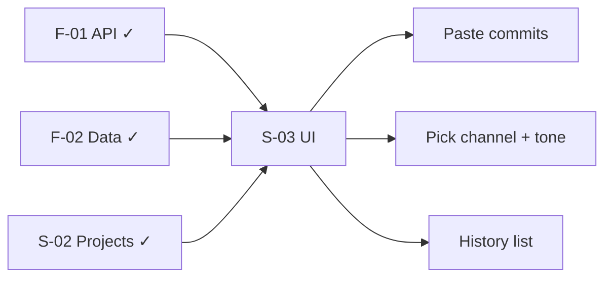

# Research: Manual commit paste + multi-channel generation

**Date**: 2026-05-30T20:35:00+02:00  
**Researcher**: Cursor Agent  
**Git Commit**: `596997d6f161c7bdca3e3271818f0ad1b1b069c9`  
**Branch**: master  
**Repository**: PatchPost

## Research Question

User pastes commit messages manually (no repo fetch — private repos), then Gemini generates patch notes / social / team update / changelog for a chosen channel. What already exists, and what does S-03 need to add?

## Summary

| Layer | Status | S-03 action |
|---|---|---|
| **Manual input** (`title` + `raw_content`) | API + DB done (F-02, FR-003) | Textarea UI — paste commits or bullet list |
| **Multi-channel generate** (`output_type` + `tone`) | API + LLM done (F-01, FR-004) | Channel + tone picker, generate button |
| **Save to history** (`generated_outputs`) | API + DB done (F-02, FR-005) | History list on project |

**Nothing new is needed on the backend for the user's intent.** S-03 is UI wiring over existing endpoints. GitHub repo import is **out of scope** — not desired (private repos) and not part of PRD MVP.

## Detailed Findings

### 1. Manual input = paste commits

FR-003 and S-03 are **manual text input**. Pasting commit messages into `raw_content` is the intended model — not reading git history.

Schema and service:

- `change_inputs.source_type` defaults to `'manual'`; `raw_content` holds the pasted text
- `POST /api/projects/{id}/change-inputs` — body: `{ title?, raw_content }`
- `createChangeInput` always sets `source_type: "manual"`

Prompts read `changeInput.raw_content` only — no distinction between “typed bullets” and “pasted commits”.

### 2. Multi-channel generation — already in API (F-01)

```6:12:src/types.ts
export const outputTypeSchema = z.enum([
  "changelog",
  "instagram_post",
  "discord_update",
  "steam_news",
  "devlog_summary",
]);
```

| User intent | `output_type` |
|---|---|
| Patch notes / changelog | `changelog` |
| Social media post | `instagram_post` |
| Team / internal update | `discord_update` |
| Steam news | `steam_news` |
| Devlog | `devlog_summary` |

Generation: `POST /api/projects/{id}/generation-runs` with `{ change_input_id, output_type, tone? }` → classify → generate → persist draft.

Workflow: `src/lib/services/generation-workflow.ts` · Prompts: `src/lib/ai/prompts.ts`

### 3. What's missing — UI only (S-03)

Project detail today is edit-only (`src/pages/app/projects/[id]/index.astro`) — no change-input form, no generate flow, no history list.

Dev smoke proves the pipeline end-to-end (`f01-generation-smoke.ts`, `f01-gemini-smoke.ts`) without product UI.

### 4. S-03 scope (for `/10x-plan`)

**In scope:**

- Textarea with helper text (e.g. “paste commit messages, one per line”)
- Optional title
- Output type selector (friendly labels → `outputTypeSchema`)
- Optional tone (default from project `default_tone`)
- Generate → show result + classified items (optional UX)
- List saved `generated_outputs` for the project

**Out of scope:**

- GitHub API, repo fetch, commit picker from remote history
- New migrations or `output_type` values (unless copy needs a distinct “team info” prompt later)



## Code References

- `src/types.ts:3-12` — manual `source_type` + five `output_type` values
- `src/pages/api/projects/[id]/change-inputs.ts` — manual POST
- `src/pages/api/projects/[id]/generation-runs.ts` — generation trigger
- `src/lib/services/generation-workflow.ts` — classify → generate → persist
- `src/lib/ai/prompts.ts` — per-channel prompts
- `src/pages/app/projects/[id]/index.astro` — no generation UI yet

## Architecture Insights

1. **Input and generation are decoupled** — once `raw_content` exists, workflow is identical regardless of how the user composed it.
2. **`output_type` is the channel switch** — S-03 exposes what F-01 already implements; no new provider work required.
3. **Classification runs before generate** (PRD business logic) — already enforced server-side; UI may surface `classifiedItems` for transparency.

## Historical Context

- F-02: manual-only `change_inputs`; generation tables ready for S-03
- F-01: classify + multi-channel generate API; UI explicitly deferred to S-03
- PRD FR-003/004: manual input → generate for chosen channel

## Open Questions (for plan)

1. Show classification results in UI before/after generate, or keep generate one-step?
2. History list: read-only in S-03, or minimal preview modal? (Full edit → S-04 / FR-006)
