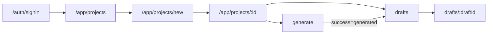

# Research: Modern app layout and view-by-view flow redesign

**Date**: 2026-06-06T20:45:00Z  
**Researcher**: Auto (Cursor Agent)  
**Git Commit**: `c51d2e32e3b679e779f186dd5d801c16a9f04542`  
**Branch**: `test/rollout-phases`  
**Repository**: [AdrianSaw/PatchPost](https://github.com/AdrianSaw/PatchPost)

## Research Question

How is PatchPost’s UI structured today (layouts, design tokens, navigation, per-view flow), and what must change to deliver a **modern design** view-by-view starting from sign-in (with existing mockup), without breaking the functional happy path guarded by e2e?

## Summary

PatchPost already uses a **cosmic dark + glass + purple accent** aesthetic, but it is **copy-pasted inline** across pages rather than expressed as shared layout primitives or design tokens. Sign-in is a **minimal centered card**; the richest mockup-aligned implementation lives on **`Welcome.astro`** (orbs, star field, Topbar, feature cards) — not on `/auth/signin`.

**Functional flow works** (e2e `main-flow.spec.ts`: sign-in → new project → generate → drafts banner), but **UX flow is implicit**: back-link navigation only, project detail doubles as settings + workflow hub, weak primary/secondary CTA hierarchy, and no project-scoped sub-nav.

Recommended plan shape:

1. **Foundation phase** — extract `CosmicShell`, `GlassCard`, `BrandTopbar`, tokens in `global.css`; wire shadcn `--primary` to brand purple.
2. **Phase 1 — Sign-in** — match mockup (logo bar, welcome copy, side feature cards, purple CTA); preserve `SignInForm` field roles/labels for e2e.
3. **Phases 2–6** — app shell with project context nav, then projects → generate → drafts → landing polish; keep `getByRole` contracts stable.

## Detailed Findings

### View inventory (user-facing)

| # | View | Route | Layout | React islands |
|---|------|-------|--------|---------------|
| 0 | Landing | `/` | `Layout` + `Welcome.astro` | — |
| 1 | **Sign-in** | `/auth/signin` | `Layout` (inline cosmic) | `SignInForm` |
| 2 | Dashboard stub | `/dashboard` | none (middleware → `/app/projects`) | — |
| 3 | Projects list | `/app/projects` | `AppLayout` | — |
| 4 | New project | `/app/projects/new` | `AppLayout` | `ProjectForm` |
| 5 | Project detail | `/app/projects/[id]` | `AppLayout` | `ProjectForm`, `DeleteProjectForm` |
| 6 | Generate | `/app/projects/[id]/generate` | `AppLayout` | `GenerateForm` |
| 7 | Draft history | `/app/projects/[id]/drafts` | `AppLayout` | — |
| 8 | Draft edit | `/app/projects/[id]/drafts/[draftId]` | `AppLayout` | `DraftEditForm`, `ClassificationPanel` |

**Auth pages not built:** `/auth/signup`, `/auth/confirm-email` redirect to sign-in ([`src/middleware.ts:30-31`](https://github.com/AdrianSaw/PatchPost/blob/c51d2e32e3b679e779f186dd5d801c16a9f04542/src/middleware.ts#L30-L31)). Invite-only; no signup UI in scope unless product changes.

### Layout architecture

**Two layouts only:**

```12:18:src/layouts/AppLayout.astro
<Layout title={title}>
  <div class="bg-cosmic min-h-screen p-4">
    <div class="mx-auto max-w-3xl">
      <Topbar />
      <slot />
```

- [`Layout.astro`](https://github.com/AdrianSaw/PatchPost/blob/c51d2e32e3b679e779f186dd5d801c16a9f04542/src/layouts/Layout.astro) — HTML shell, `global.css`, config banners.
- [`AppLayout.astro`](https://github.com/AdrianSaw/PatchPost/blob/c51d2e32e3b679e779f186dd5d801c16a9f04542/src/layouts/AppLayout.astro) — cosmic bg, `max-w-3xl`, Topbar, single glass card slot.

**Sign-in bypasses AppLayout** — centered card only ([`signin.astro:8-19`](https://github.com/AdrianSaw/PatchPost/blob/c51d2e32e3b679e779f186dd5d801c16a9f04542/src/pages/auth/signin.astro#L8-L19)).

**Topbar** ([`Topbar.astro`](https://github.com/AdrianSaw/PatchPost/blob/c51d2e32e3b679e779f186dd5d801c16a9f04542/src/components/Topbar.astro)): email, Projects link, Sign out — **no logo**, no project context, no active route styling.

### Design system state

| Layer | Location | Gap vs mockup |
|-------|----------|---------------|
| Tailwind v4 + shadcn tokens | `src/styles/global.css` | `.dark` defined but never applied; app uses inline classes |
| Cosmic bg | `@utility bg-cosmic` | Sign-in lacks orbs/star field from Welcome |
| Glass panel | duplicated 7× | No `GlassCard` component |
| Purple CTA | `SubmitButton` override | Not in `--primary`; shadcn default unused |
| Feature cards | `Welcome.astro:50+` | Absent on sign-in |
| Logo header bar | mockup | No PatchPost wordmark component |

**Closest mockup reference in repo:** [`Welcome.astro`](https://github.com/AdrianSaw/PatchPost/blob/c51d2e32e3b679e779f186dd5d801c16a9f04542/src/components/Welcome.astro) — orbs, star field, Topbar, purple CTA, three feature cards. Landing copy still says **“10x Astro Starter”** (line 35) — brand inconsistency.

**Auth form kit** (preserve for e2e): [`FormField.tsx`](https://github.com/AdrianSaw/PatchPost/blob/c51d2e32e3b679e779f186dd5d801c16a9f04542/src/components/auth/FormField.tsx), [`SignInForm.tsx`](https://github.com/AdrianSaw/PatchPost/blob/c51d2e32e3b679e779f186dd5d801c16a9f04542/src/components/auth/SignInForm.tsx) — labels **Email**, **Password**, button **Sign in**; POST `/api/auth/signin`.

### Flow clarity issues (functional but unclear)



1. **No guided linear story** — create → generate → review requires discovering equal-weight Generate/Drafts on project detail.
2. **Project detail overload** — settings form + danger zone + workflow entry on one screen ([`[id]/index.astro`](https://github.com/AdrianSaw/PatchPost/blob/c51d2e32e3b679e779f186dd5d801c16a9f04542/src/pages/app/projects/%5Bid%5D/index.astro)).
3. **Back-link-only nav** — purple `← Back`; no breadcrumbs or project sub-nav.
4. **Weak CTA hierarchy** — primary actions use same outline style as secondary links.
5. **Success UX** — query-param banners on drafts list only; generate redirects to list not draft detail.
6. **Narrow `max-w-3xl`** — fine for forms, tight for mockup’s multi-column auth layout.

### E2e guardrails (must not break)

[`tests/e2e/main-flow.spec.ts`](https://github.com/AdrianSaw/PatchPost/blob/c51d2e32e3b679e779f186dd5d801c16a9f04542/tests/e2e/main-flow.spec.ts) asserts:

- `getByRole('textbox', { name: 'Email'|'Password' })`, `getByRole('button', { name: 'Sign in' })`
- `getByRole('textbox', { name: 'Project name' })`, **Create project**
- `getByRole('link', { name: 'Generate' })`, **Changes** field, **Generate draft**
- `/drafts?success=generated`, text **Draft saved to history.**

Visual redesign must keep **accessible names** and **navigation targets** stable (or update e2e in same change).

## Code References

| Path | Role |
|------|------|
| `src/styles/global.css` | Tailwind v4, shadcn vars, `bg-cosmic` |
| `src/layouts/Layout.astro` | Root HTML shell |
| `src/layouts/AppLayout.astro` | Authenticated app shell |
| `src/components/Topbar.astro` | Global nav bar |
| `src/components/Welcome.astro` | Richest cosmic UI reference |
| `src/pages/auth/signin.astro` | Sign-in page shell (redesign target #1) |
| `src/components/auth/*` | Form field kit |
| `src/pages/app/projects/**` | Core product views |
| `tests/e2e/main-flow.spec.ts` | North-star regression guard |
| `tests/e2e/fixtures/auth.ts` | Sign-in helpers |

## Architecture Insights

- **Astro for shells, React for interactivity** — redesign layouts in `.astro`; restyle forms in `.tsx` without changing POST/fetch contracts.
- **`cn()` from `@/lib/utils`** — extend with shared layout components rather than new class-string concat (AGENTS.md rule).
- **shadcn gap** — only button/label/select/textarea; no Card/Input. Either add shadcn components or formalize custom `FormField` as the design-system input.
- **Single source of truth for glass/cosmic** — extract from Welcome + sign-in duplication before rolling to app pages.

## Historical Context

- US-01 flow semantics: `context/archive/2026-05-30-manual-to-generated-history-flow/`
- E2e wiring: `context/archive/2026-06-06-testing-ci-gates-e2e/` — Playwright encodes current DOM contract.
- Projects CRUD UI: `context/archive/` projects-crud-core — original page structure likely unchanged since slice.

## Proposed view-by-view rollout (for `/10x-plan`)

| Phase | View(s) | Deliverable |
|-------|---------|-------------|
| 0 | Design foundation | Tokens + `CosmicShell`, `GlassCard`, `BrandTopbar`, optional shadcn Card/Input |
| 1 | Sign-in | Mockup parity; reuse Welcome orbs/cards pattern |
| 2 | App shell + Topbar | Logo, nav active states, optional project breadcrumb slot |
| 3 | Projects list + new | Empty state, clearer primary CTA, onboarding hint |
| 4 | Project detail | Split settings vs workflow hub (tabs or routes) |
| 5 | Generate + drafts | Step indicator, stronger success → draft detail option |
| 6 | Draft edit + landing | Polish, PatchPost branding on `/` |

## Open Questions

1. **Project detail split** — separate `/settings` route vs tabs on same URL?
2. **Landing scope** — rebrand `Welcome.astro` only, or new marketing page?
3. **Mobile** — mockup is desktop-first; define breakpoints for stacked feature cards on sign-in.
4. **Signup/confirm-email** — stay redirect-only (invite-only) or add styled “contact admin” page?
5. **Dashboard route** — remove stub or build real post-login home?

## Related Research

- None prior for this change-id. Closest: archived slice plans under `context/archive/` for feature semantics, not UI.
